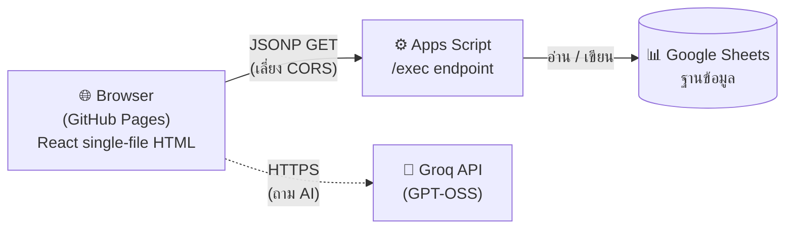

# 🏢 Meeting Room Booking System

ระบบจองห้องประชุมภายในองค์กร แบบ **single-file HTML** เชื่อมต่อ **Google Sheets** เป็นฐานข้อมูลผ่าน **Google Apps Script** — ไม่ต้องมี server, ไม่ต้องใช้ build tool, โฮสต์ฟรีบน GitHub Pages


-61DAFB?logo=react&logoColor=black)

-F55036)


---

## 🔗 ลิงก์สำคัญ

| รายการ | ลิงก์ |
|--------|-------|
| 🌐 **เว็บแอป (Live Demo)** | https://mud-and-hound.github.io/Booking-meeting/ |
| 📊 **Google Sheet (ฐานข้อมูล)** | [เปิดชีต](https://docs.google.com/spreadsheets/d/1miyON7Qr_W8PdUxtSX_qsvLzmLtL7dp-qgVknZt1uV0/edit?usp=sharing) |
| ⚙️ **Apps Script (Backend API)** | [เปิดโปรเจกต์ Apps Script](https://script.google.com/u/0/home/projects/1rOCSeOtco0raBSuckSeME9I8vILpQSvkudEOv4GGzLczZwdYg35VdXqb/edit) |

---

## ✨ ฟีเจอร์หลัก

| หมวด | รายละเอียด |
|------|-----------|
| 📅 **ปฏิทินหลายมุมมอง** | ตารางห้อง (รายเดือน) · รายวัน · รายสัปดาห์ · รายเดือน |
| ✍️ **จองห้อง + กันชนเวลา** | ตรวจสอบเวลาชนกันทั้งฝั่ง UI และ **เช็คซ้ำที่ Server** กันการจองทับ |
| 🔐 **ล็อกอิน / สมัครสมาชิก** | ระบบสมาชิกพร้อมบทบาท (ผู้จองทั่วไป vs แอดมิน/IT) |
| 🎫 **เช็คอิน + ปล่อยห้องอัตโนมัติ** | นับถอยหลัง ถ้าไม่เช็คอินจะปล่อยห้องคืนอัตโนมัติ |
| 🤖 **ผู้ช่วย AI (แชทบอท)** | ถามเรื่องห้องว่าง/ความจุ/อุปกรณ์ ตอบจากข้อมูลจริง (Groq) |
| 💾 **บันทึกแบบ Real Sheet** | ทุกการจองเขียนลง Google Sheet ทันที พร้อม UX overlay → skeleton → ติ๊กเขียว |
| 📊 **รายงาน** | สรุปการใช้งานห้อง อัตราการใช้งาน และห้องยอดนิยม |
| 🌗 **Dark / Light Mode** | สลับธีมทั้งระบบ + รองรับมือถือ (responsive) |

---

## 🏗️ สถาปัตยกรรม



**ทำไมใช้ JSONP?** การเรียก Apps Script ด้วย `fetch()` จากเบราว์เซอร์จะติด CORS preflight — JSONP (แนบ `?callback=`) เป็นวิธีที่ทำงานข้ามโดเมนได้จริงโดยไม่ติดปัญหานี้

---

## 📁 โครงสร้างไฟล์

```
Booking-meeting/
├── index.html                  # เว็บแอปทั้งหมด (React + UI + API layer)  ← เปลี่ยนชื่อจาก meeting-room-booking-v3.html
├── MeetingRoom_AppsScript.gs    # โค้ด Backend (วางใน Apps Script Editor)
└── README.md
```

> 💡 ไฟล์ `.gs` **ไม่ได้อยู่ใน repo เพื่อรัน** — ใช้สำหรับเก็บโค้ดเวอร์ชันควบคุม แล้วนำไปวางใน Apps Script Editor (ดูขั้นตอน Setup)

---

## 🗄️ โครงสร้างฐานข้อมูล (4 ชีต)

ไฟล์ Google Sheet ชื่อ **`MeetingRoom_System`** ประกอบด้วย 4 ชีต:

### 1. `Bookings` — ข้อมูลการจอง
| คอลัมน์ | ความหมาย |
|---------|----------|
| bookingId | รหัสการจอง (B0001...) |
| date | วันที่ (รูปแบบ ISO `yyyy-mm-dd`) |
| start / end / duration | เวลาเริ่ม / สิ้นสุด / ระยะเวลา |
| room | รหัสห้อง (A, B, BR...) |
| title / attendees | หัวข้อ / จำนวนผู้เข้าร่วม |
| owner / by | userId ผู้จอง / ชื่อที่แสดง |
| link / status / checkedIn | ลิงก์ Zoom / สถานะ / เช็คอินแล้วหรือยัง |
| createdAt | เวลาที่สร้างรายการ |

### 2. `Users` — สมาชิก
`userId` · `password` · `displayName` · `dept` · `role` · `createdAt`

### 3. `_Rooms` — ห้องประชุม
`roomId` · `name` · `capacity` · `equipment` · `colorFrom` · `colorTo`

### 4. `_AIKeys` — คีย์ AI (ไม่ฝังในโค้ด)
`name` · `provider` · `apiKey` · `projectName` · `projectNumber` · `active`

> ⚠️ คอลัมน์ที่เป็นตัวเลขแต่ต้องเก็บเป็นข้อความ (เวลา, รหัสผ่าน, userId, เบอร์โทร) ถูกบังคับเป็น **Plain text** ใน Apps Script เพื่อกัน Google Sheets ตัดเลข 0 นำหน้าทิ้ง

---

## 🚪 ห้องประชุมเริ่มต้น (6 ห้อง)

| รหัส | ชื่อห้อง | ความจุ | อุปกรณ์ |
|------|---------|--------|---------|
| A | MUD 1 | 12 | TV, Projector, Whiteboard |
| B | MUD 2 | 20 | TV, Video Conf, Whiteboard |
| C | MUD 3 | 8 | TV, Whiteboard |
| BR | Board Room | 16 | TV, Projector, Video Conf, Whiteboard |
| D | MUD 4 | 6 | TV |
| TR | Training Room | 30 | Projector, Video Conf, Whiteboard |

---

## 🚀 การติดตั้ง (Setup)

### ขั้นที่ 1 — เตรียม Backend (Apps Script)
1. เปิด [Apps Script Project](https://script.google.com/u/0/home/projects/1rOCSeOtco0raBSuckSeME9I8vILpQSvkudEOv4GGzLczZwdYg35VdXqb/edit)
2. วางโค้ดจาก `MeetingRoom_AppsScript.gs` ลงไป (แทนที่ของเดิม)
3. รันฟังก์ชัน **`setupInitial()`** หนึ่งครั้ง → สร้าง 4 ชีต + ข้อมูลตัวอย่างอัตโนมัติ
4. กด **Deploy → New deployment → Web app**
   - **Execute as:** `Me`
   - **Who has access:** `Anyone` ⬅️ **สำคัญมาก** (JSONP จะใช้ไม่ได้ถ้าตั้งเป็น restricted)
5. คัดลอก **Web App URL** (`.../exec`)

### ขั้นที่ 2 — ตั้งค่า Frontend
6. เปิด `index.html` แล้วหาบรรทัด:
   ```js
   const API_URL = "PASTE_YOUR_WEB_APP_URL_HERE";
   ```
   วาง Web App URL ที่ได้จากขั้นที่ 1 แทน

### ขั้นที่ 3 — Deploy ขึ้น GitHub Pages
7. Push `index.html` ขึ้น repo
8. **Settings → Pages → Branch:** `main` → `/root` → Save
9. รอสักครู่ แล้วเปิด `https://<username>.github.io/<repo>/`

---

## 🤖 ตั้งค่าผู้ช่วย AI (Groq)

ระบบใช้ **Groq** เป็นค่าเริ่มต้น (โมเดล `openai/gpt-oss-20b` — ฟรี เร็ว)

1. ขอ API key ฟรีที่ 👉 https://console.groq.com/keys (ไม่ต้องใช้บัตร)
2. เปิด [Google Sheet](https://docs.google.com/spreadsheets/d/1miyON7Qr_W8PdUxtSX_qsvLzmLtL7dp-qgVknZt1uV0/edit?usp=sharing) → ชีต **`_AIKeys`** → แถว "Groq หลัก" → วาง key ในคอลัมน์ **`apiKey`**
3. รีเฟรชเว็บ → ผู้ช่วย AI พร้อมใช้งาน

| Provider | โมเดลเริ่มต้น | หมายเหตุ |
|----------|--------------|----------|
| **Groq** (ค่าเริ่มต้น) | `openai/gpt-oss-20b` | ฟรี เร็วมาก เหมาะแชทบอท |
| Google Gemini | `gemini-2.5-flash` | ตัวเลือกสำรอง |
| OpenAI | `gpt-4o-mini` | ตัวเลือกสำรอง (เสียเงิน) |

> 💡 ความ "ฉลาด" ของ AI ขึ้นกับ **โมเดล + ข้อมูลที่ป้อน** ไม่ใช่แค่ key — ระบบส่งรายชื่อห้อง ความจุ อุปกรณ์ และช่องเวลาว่างจริงไปให้ AI ทุกครั้ง เพื่อให้ตอบได้แม่นและไม่มั่ว

---

## 👤 บัญชีทดลอง (สร้างจาก `setupInitial`)

| User ID | รหัสผ่าน | บทบาท |
|---------|----------|-------|
| `u1` | `1234` | แอดมิน / IT (แก้/ยกเลิกของทุกคนได้) |
| `somchai` | `1234` | สมาชิกทั่วไป |
| `demo` | `1234` | สมาชิกทั่วไป |

---

## ⚠️ ข้อควรระวัง

- 🔑 **อย่าฝัง API key ลงในโค้ด HTML** — เพราะ GitHub สแกนเจอจะถูกเพิกถอนทันที ระบบนี้ดึง key จากชีต `_AIKeys` แทน (ปลอดภัยกว่า)
- 🔓 **Deploy ต้องเป็น "Anyone"** — ไม่งั้น JSONP เชื่อมต่อไม่ได้ (เว็บจะค้างหน้าโหลด)
- 🛡️ **สิทธิ์การเขียนเป็นแค่ UI gating** — Apps Script ไม่ได้บังคับสิทธิ์ระดับ row ใครมี URL ก็เขียนได้ผ่าน API ตรง ๆ หากต้องการความปลอดภัยสูงขึ้น แนะนำเพิ่ม Cloudflare Worker เป็น proxy
- 🔄 **Groq เปลี่ยนโมเดลบ่อย** — หากแชทบอทขึ้น error เรื่องโมเดล ให้เช็คโมเดลล่าสุดที่ [Groq Models](https://console.groq.com/docs/models) แล้วแก้ในชีต `_AIKeys` หรือหน้าตั้งค่า

---

## 🛠️ Tech Stack

| ส่วน | เทคโนโลยี |
|------|-----------|
| Frontend | React 18 (CDN) + Babel Standalone, single-file HTML, ฟอนต์ Prompt |
| Backend | Google Apps Script (Web App `/exec`) |
| Database | Google Sheets |
| Cross-origin | JSONP (GET + callback) |
| AI | Groq API (OpenAI-compatible) |
| Hosting | GitHub Pages |

---

<div align="center">

**Meeting Room Booking System** · พัฒนาสำหรับการจัดการห้องประชุมภายในองค์กร

</div>
